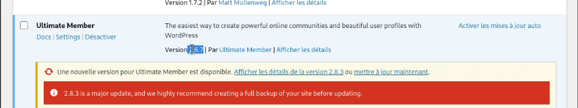

#
<h2>WordPress Vulnerability Exploited - SQL Injection Vulnerability</h2>

- <b>Published: 2024-03-13</b>

- <b>Updated: 2024-03-13</b>

- <b>Common Vulnerabilities and Exposures ID: CVE-2024-1071</b>

- <b>CVSS v3 Score: 9.8 (Critical)</b>

- <b>Recorded Future: 89 (Critical)</b>
  
- <b>Description:This vulnerability in the Ultimate Member plugin for WordPress. This vulnerability allows attackers to inject malicious SQL code into the plugin, potentially leading to unauthorized access to sensitive information or even complete control of the affected website.</b>

- <b>Data Exposure: Attackers could steal sensitive information such as usernames, passwords, and personal data.</b>

- <b>Website Takeover: In severe cases, attackers could gain full control of the website, allowing them to modify or delete content, spread malware, or launch further attacks.</b>

## Affected Versions
- Specific Ricoh MFPs and Printers

## Attack Vector
- SQL injection

## Impact
- Unauthorized access to sensitive information or complete control of the affected website

## Mitigation
- Update the Ultimate Member plugin to the latest version (2.12.1 or later)


## Aditional Information
The Ultimate Member – User Profile, Registration, Login, Member Directory, Content Restriction & Membership Plugin plugin for WordPress is vulnerable to SQL Injection via the 'sorting' parameter in versions 2.1.3 to 2.8.2 due to insufficient escaping on the user supplied parameter and lack of sufficient preparation on the existing SQL query. This makes it possible for unauthenticated attackers to append additional SQL queries into already existing queries that can be used to extract sensitive information from the database.


### Finding Targets

To find potential targets, use Fofa (similar to Shodan.io):
- **FOFA Dork** : `body="/wp-content/plugins/ultimate-member"`
- **Hunter** : `Hunter: body="/wp-content/plugins/ultimate-member"`

## Now we need to clone the repository
```bash
- git clone https://github.com/fa-rrel/CVE-2024-1071-SQL-Injection.git
- cd CVE-2024-1071-SQL-Injection
```

Next chose your target and add it to urls.txt file in this format:

- https://testphp.vulnweb.com/
- https://www.hackthissite.org/
- https://www.acunetix.com/

## Run The Exploit:

```bash
python3 CVE-2024-1071.py -f urls.txt
```

# Reference POC
- https://nvd.nist.gov/vuln/detail/CVE-2024-1071
- https://github.com/gbrsh
- https://wpscan.com/vulnerability/dcca7ed0-b088-4b7d-9e22-07b858367975/
- https://www.broadcom.com/support/security-center/protection-bulletin/cve-2024-1071-wordpress-ultimate-member-plugin-vulnerability
- https://vuldb.com/?id.254667

## SecAdmin Notes
- This has been created purely for the purposes of academic research and for the development of effective defensive techniques, and is not intended to be used to attack systems except where explicitly authorized. Project maintainers are not responsible or liable for misuse of the software. Use responsibly.
